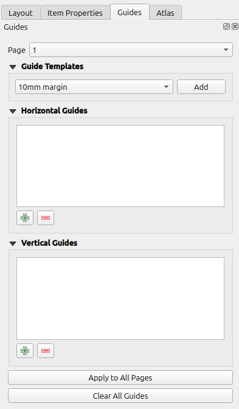
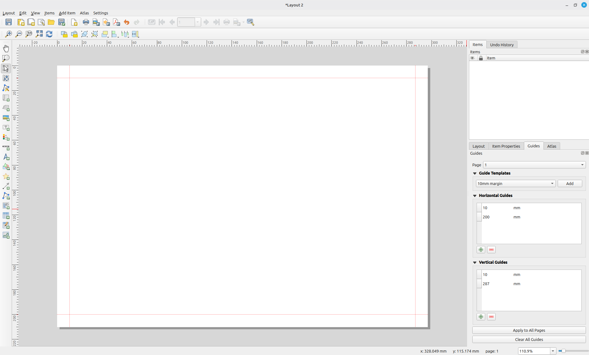

# Layout Guide Tools

A QGIS Plugin to create Layout Guides from templates.

## Features

- Dynamic margin templates that adapt to the current page size
- Static horizontal/vertical templates with fixed positions
- Custom templates stored in the QGIS profile

## Usage

1. Open a print layout and show the Guides panel
2. Pick a template from the Guide Templates group
3. Click Add to apply the guides to the current page QGIS Plugin to create Layout Guides from templates

### Screenshots




## Custom templates

Templates live in `guide_templates.json` inside your QGIS profile
(`<profile>/layout_guide_tools/guide_templates.json`).
Two formats are supported:

```json
{
  "10mm margin": { "dynamic": 10 },
  "A4 Landscape Custom": { "horizontal": [20, 200], "vertical": [10, 287] }
}
```

- `dynamic` takes a margin in millimeters and must not be combined with `horizontal`/`vertical`
- `horizontal`/`vertical` take lists of fixed positions in millimeters
